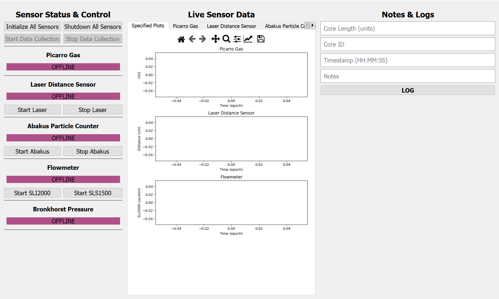
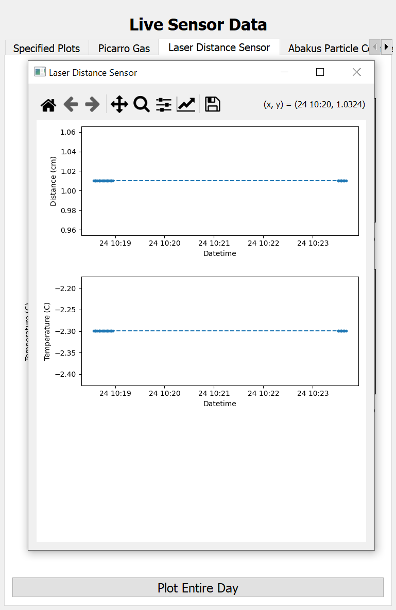
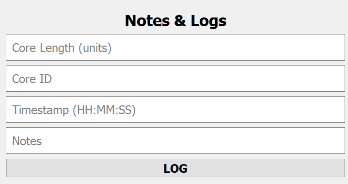
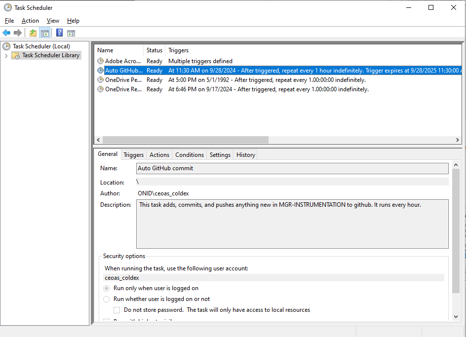

# MGR Instrumentation
Codebase and documentation for unified data collection of the OSU COLDEX Marine and Geologic Reserve lab instrumentation.

## Overview

The purpose of this repository is to provide a centralized hub for the sensors and instruments used to collect ice core data at COLDEX, the Center for OLDest ice EXploration. Sensor status, control, and live data streaming are all managed with a GUI. Data and notes are timestamped and saved to the disk - for more info, see [Data Management](#data-management). 

The current sensors integrated into this repository are the [Picarro Gas Concentration Analyzer](https://www.picarro.com/environmental/products/g2401_gas_concentration_analyzer), [Abakus Particle Counter](https://www.fa-klotz.de/particlecounters/liquids/particle-counter-liquids.php), Sensirion Liquid Flow Meters ([1](https://sensirion.com/products/catalog/SLI-2000) & [2](https://sensirion.com/products/catalog/SLS-1500)), and [Bronkhorst Pressure Controller](https://www.bronkhorst.com/en-us/products-en/pressure/iq-flow/?page=1#).

In this README:

- [Installation/setup procedures](#getting-started)
- [How to use the codebase](#running)
- [Elements of the GUI](#gui)
- [Data](#data-management) & [logs](#logs)

More documentation exists in the READMEs of each subfolder:

- [Sensor Interfaces README](sensor_interfaces/README.md): documentation of the **sensors**, including user manuals, interfaces, the simulated setup hardware, and steps for [adding a new sensor](sensor_interfaces/README.md#adding-a-new-sensor).

- [Data Pipeline README](main_pipeline/README.md): crunchier documentation of the **data processing pipeline**, such as how data gets passed from sensing → interpreting → saving.

## Getting Started

This section goes over installation and setup of this repository. If you're reading this README from the MGR lab computer, this has already been taken care of - you can start [using the codebase](#running).

### Installation

This project can be installed from GitHub with

    git clone https://github.com/ali-clara/MGR-instrumentation.git

Or by using [GitHub desktop](https://github.com/apps/desktop), which I recommend for Windows and for folks who aren't too familiar with `git`.

### Dependencies
I highly recommend setting up a virtual environment to hold and store this codebase, especially for lab computers with multiple users. This allows you to run Python locally in the environment, instead of globally on your machine, which gets rid of a lot of import/path headaches. A good IDE can make this really easy ([here's a walkthrough for VSCode](https://code.visualstudio.com/docs/python/environments#_creating-environments)). Once you have your environment, you can import all the dependencies needed for this repository by running the following from the main directory:

    pip install -r requirements.text

If you don't want to use a virtual environment, you'll need to import the following:

- [numpy](https://pypi.org/project/numpy/)
- [pandas](https://pypi.org/project/pandas/)
- [pyserial](https://pypi.org/project/pyserial/)
- [matplotlib](https://pypi.org/project/matplotlib/)
- [logdecorator](https://pypi.org/project/logdecorator/)
- [PyYAML](https://pypi.org/project/pyyaml/)
- [readerwriterlock](https://pypi.org/project/readerwriterlock/)
- [PyQt5](https://pypi.org/project/PyQt5/)

### Configuration Files

To make this codebase easier to modify, it uses a set of YAML files to configure internal parameters, such as the sensors we display on the live-plotting screens, the directories we save data to, and the sensor communication ports. These files and their functions are described here, as well as what elements to configure upon setup.

- *sensor_comms.yaml* - Sets the sensor communication parameters, such as serial port and baud rate.

    - <mark>**Configure upon setup**:</mark> Set the correct serial port for each sensor. You can find this information by plugging in the sensors one at a time and noting what ports become active, either in the Windows Device Manager (under COM & LPT) or through the command line.

- *data_saving.yaml* - Sets the directories where sensor data and logged notes get stored and allows you to set a unique suffix for your saved files.
    
    - <mark>**Configure upon setup**:</mark> Set the directories to a valid location on your device

- *sensor_data.yaml* - Sets up internal data management. You can comment out lines or entire sensor blocks to prevent that data from being plotted and saved.

    - **Configure upon setup**: Nothing required

- *log_entries.yaml* - Sets the text entries that pop up on the Logging & Notetaking GUI panel.

    - **Configure upon setup**: Nothing required

- *main_page_plots.yaml* - Sets what sensors and what data channels of those sensors get plotted on the main data-streaming page.

    - **Configure upon setup**: Nothing required

## Running

The source code of the main executable is `gui.py`, which can either be run in an IDE or by running `python gui.py` from the command line (within your virtual environment, if using).

The executable form is named XXXX and is located on at XXXX on the lab computer.

## GUI 
The GUI is divided into three main panels.

#### 1. Sensor Status and Control:

This panel has general buttons for sensor initialization/shutdown and data collection start/stop. For the sensors that have control capability, sensor-specific buttons exist as well.

Each sensor has a status indicator that updates after initialization and shutdown. The status options are offline, online, shadow hardware, and error.

Offline: The sensor is either shut down or not initialized.

Online: The sensor initialized without error.

Shadow Hardware: The sensor is either intentionally not plugged in or its communications failed. It is running "shadow hardware", which is a mode both useful for debug/development and convenient in that it allows us to run the sensor pipeline without error despite a lack of sensors. For more detail, see the [Sensor Interfaces README](sensor_interfaces/README.md) - suffice to say here that it's expected and normal *unless* you're trying to use a real sensor.

Error: The sensor encountered an error in initialization, check the log files for more information.

#### 2. Live Sensor Data:

This panel displays live data from each of the sensors, as well as a main page with specified plots. You can switch between the sensors by clicking or scrolling through the tabs at the top of the panel. Each tab displays data for the different channels available for each sensor.

The plots are interactive and controlled through the toolbar below the tabs. The toolbar has features for panning, zooming, and saving the current plots to an image.

By default, the plots keep a buffer of 5000 data points - at a collection rate of one data point/second, this will be about an hour and 20 minutes of data. These values can both be changed in the GUI source code, but too long of a buffer can impact memory and performance. 

In order to visualize more data, there is a separate button at the bottom of all sensor plots called "Plot Entire Day". As you might expect, this plots the entire day of data. It opens a separate window with the same sensor channels shown in the live plots, but over a longer timescale. These plots are also interactive.

#### 3. Notes & Logs:

The notes and logs panel has text entries for a number of data collection features we might want to hold onto. This gets saved and internally timestamped every time you hit "Log". None of the text entry fields are required.

## Data Management

### Data Timestamps

### Data Saving
Each day the main script is run, it creates two CSV files: by default, these are named "YYYY-MM-DD.csv" and "YYYY-MM-DD_notes.csv". Sensor data gets saved to the first file and user-logged notes get saved to the second.

If you want to take multiple, distinct sets of data each day, the **suffix** of both files can be modified by the *data_saving.yaml* configuration file. The first time the main script is run after changing the suffix, it will create a new data file with the name "YYYY-MM-DDsuffix.csv".

Data is, by default, saved to the "data" directory of this package. You can also use the *data_saving.yaml* configuration file to customize this location.

### Data Backup

In the main folder of this repository is the shell script **auto-commit.sh**. This script adds, commits, and pushes everything in this repository to GitHub. On Windows, you can automate this process by adding it to *Task Scheduler*. I've done this for the MGR lab computer - it runs every hour, assuming ceoas_coldex is logged in, and expires on 9/28/2025.

To manually back up to GitHub, you can use GitHub Desktop, use the GitHub command line interface, or trigger the shell script with the following:

    cd Documents\GitHub\MGR-instrumentation
    start auto-commit.sh

Note that the shell script pushes to the **main branch**.

## Logs

Not to be confused with user-input notes & logs about the science being done, this package creates internal log files in the `log` directory each day it's run. Errors, warnings, and info about this package's processes get logged and timestamped there.

